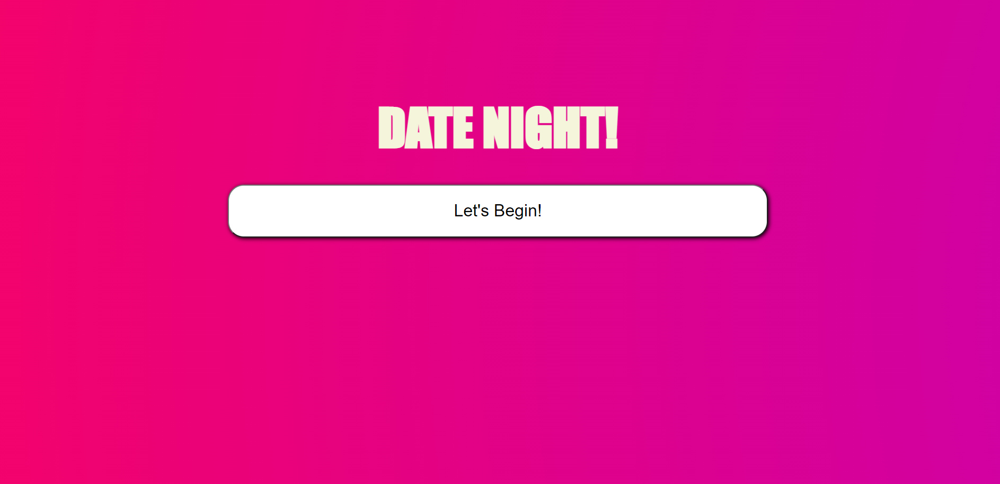
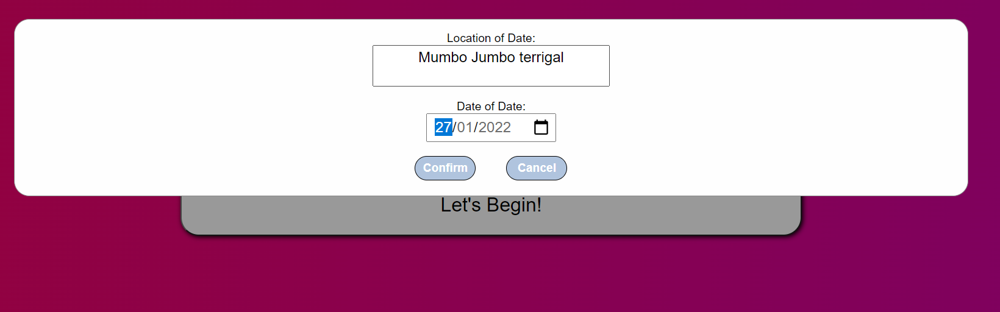
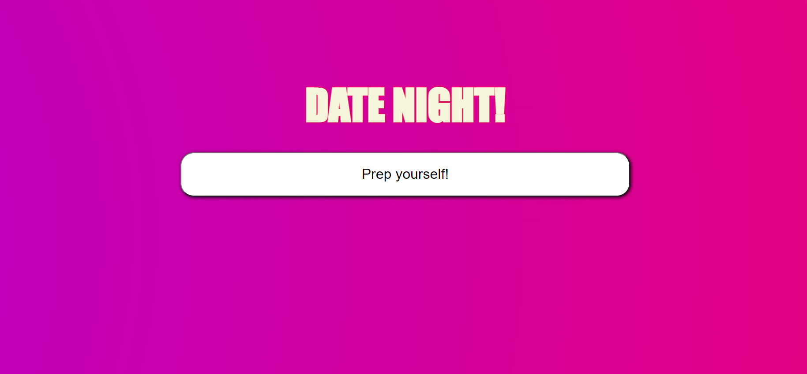
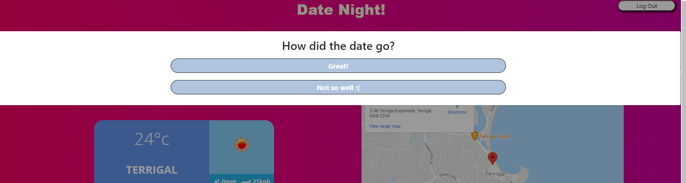

## Date Night - Project One

## Description

As a group we decided to build an app that helps a nervous person to schedule his date and get a direction, 

knows the weather on that date, clothes, drinks, joke and quote suggestions.

 Steps that have been done to get the result:

* Identify real world problem to address.

* Drawing a flow chart to break down the code.

* Listing all the APIs we need for the App.

* Splitting tasks for each contributor to do.

* Discussing the results and debugging the code together.

## User Story

```
AS A nervous person
I WANT help with confidence when going on a date
SO THAT I can have a successful date
```

## Acceptance Criteria

```
GIVEN a website to help me
WHEN I enter a location
THEN the website will provide me with the weather for the location of the date, directions to the location, time taken to get there and a playlist of that length
WHEN the weather is presented
THEN clothing suggestions are made
WHEN I realise I'm nervous about what to say
THEN the site offers a joke, quote, and drinks suggestions
WHEN the date is over
THEN the website asks if it went well
WHEN I respond with yes or no,
THEN a comedic response is given.
```

## Technologies

* HTML
* CSS
* JAVASCRIPT
* JQUERY
* MOMENTJS
* APIs (tomtom, openweathermap, unsplash, jokes, quotable, moment, jQuery, brewdog, and thecocktaildb)


**ACTION**

Writing of a solution to resolve the situation, including:
* Layout
  * *Layout is responsive and functional on various screen sizes*
  * *Simple, yet attractive design*
  * *Logical layout*
  * *Improved code visualisation - eg: indentation*
  * *Error free loading*
  * *Favicon designed and added*
  * *Thorough comments*
  * *Intuitive design with messages to users*
* Javascript
  * *Error free performance*
  * *Multiple functions to separate aspects of code*
  * *Thorough comments*
* API's connected to throughout the app:
  * Moment.js - for time handling
* GIT
  * *Numerous commits to track changes in code*
  * *Code added to public repository and Github Pages for public viewing*


## Installation

Please use the following link to view the web page [GitHub Pages](https://nbs5000.github.io/dateNight).

GitHub link : [Project 1](https://github.com/NBS5000/dateNight).

## Contributors

* Steve Barry
* Mona Mahmoud
* Samer Balee
* Joel Shewan

## Usage

Here is a video link of the app in use: 
[Date Night!](https://watch.screencastify.com/v/EnjlnMk0EY8Nm0eC7Khx).

Alternatively, here are a screenshots:

* The Welcome page:

    > 

* The User Input modal:

    > 

* The Date page:

    > 

* The 'open date' Welcome page:

    > 

* The Assessment modal:

    > 

---

<p style="text-align:center;">© 2021 Trilogy Education Services, LLC, a 2U, Inc. brand. Confidential and Proprietary. All Rights Reserved.</p>
